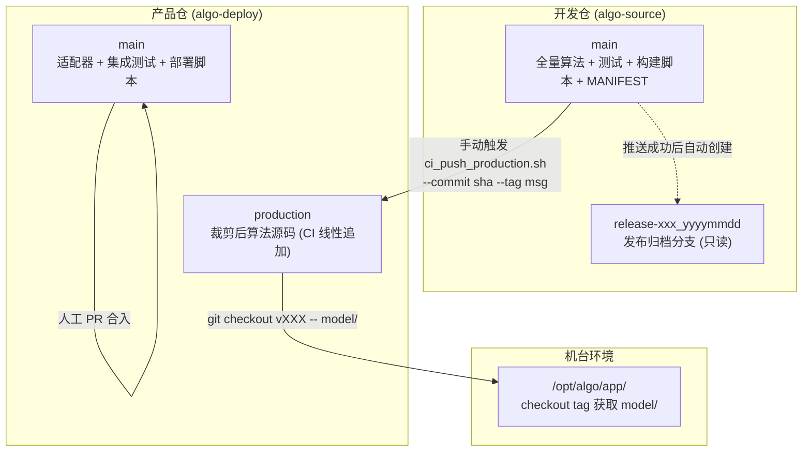
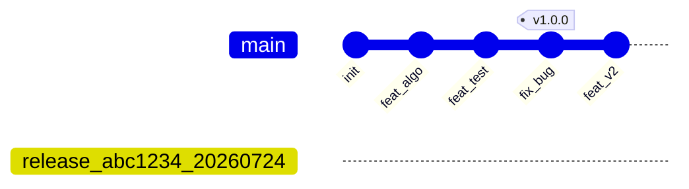
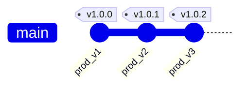
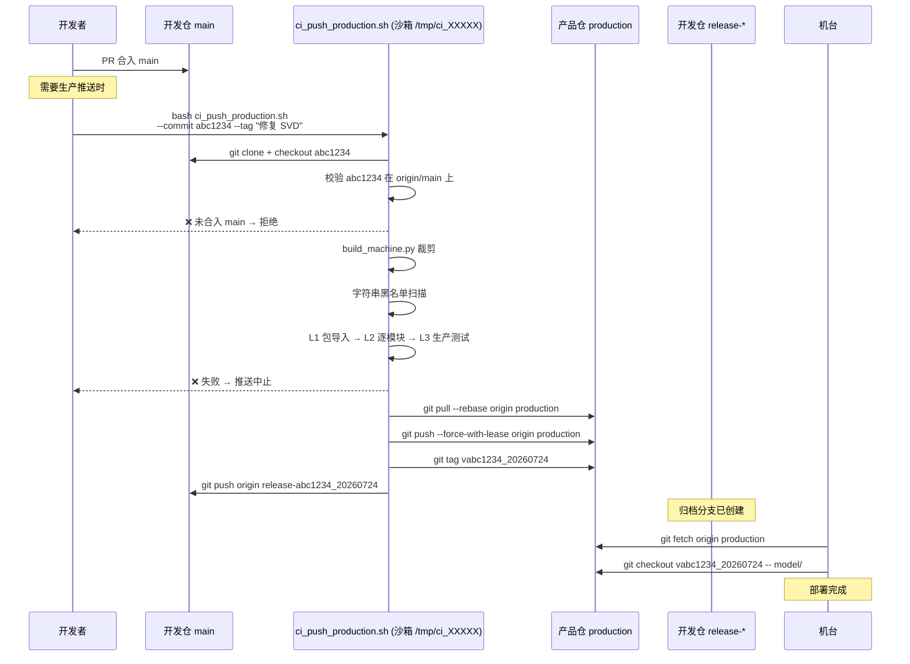
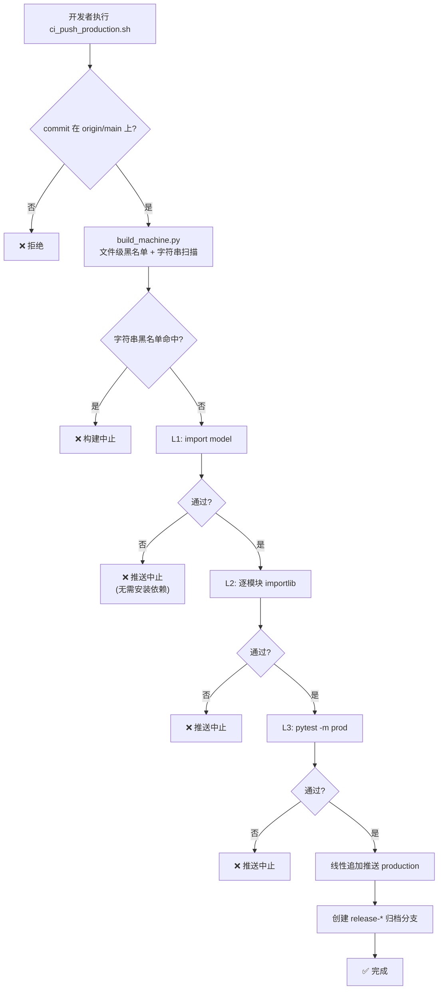
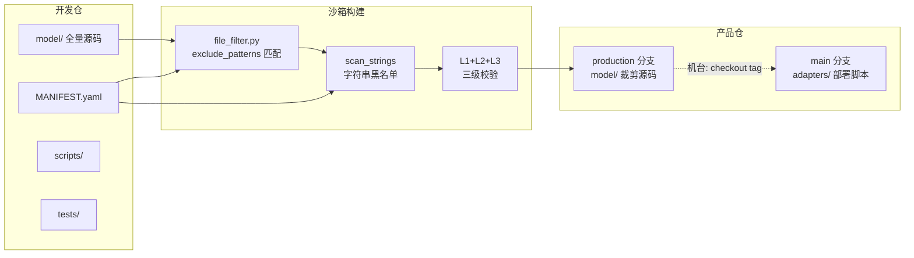

# 仓库架构与同步流程

## 一、仓库全景



## 二、分支关系





| 仓库 | 分支 | 写权限 | 说明 |
|------|------|:---:|------|
| **algo-source** | `main` | 人工 PR | 唯一源码事实，所有算法、测试、构建脚本在此演进 |
| | `release-{sha}_{ts}` | CI 自动 | 每次生产推送后创建，指向推送时的源码 commit，只读归档 |
| **algo-deploy** | `main` | 人工 PR | 胶水适配器、集成测试、部署脚本，不含算法源码 |
| | `production` | CI 线性追加 | 孤儿分支，仅含裁剪后 `model/` + `VERSION`，每次推送新增一个 commit |

## 三、同步推送流程



## 四、校验闸门



## 五、数据流向



## 六、版本追踪链

```
机台运行的 model/
  → 产品仓 production tag: v846638a_202607241450
    → production commit: 584727c
      → "source=846638a"
        → 开发仓 commit: 846638a
          → 归档分支: release-846638a_202607241450
```
