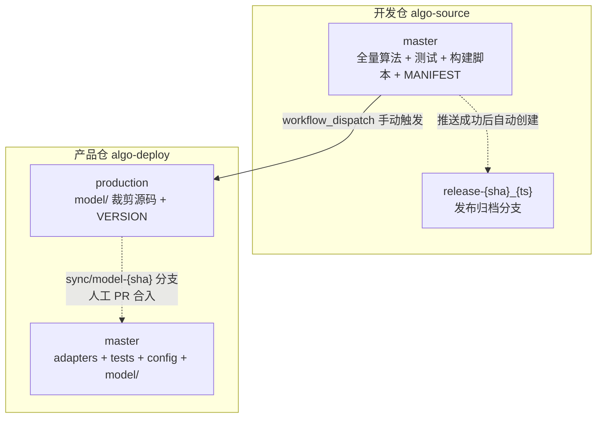
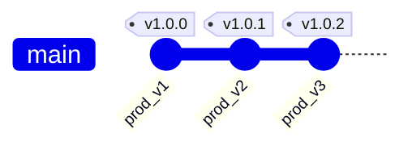

# Python 算法分仓管理 — 详细设计文档

> **版本**: v3.0 | **日期**: 2026-07-27 | **状态**: 已落地
> **配套**: [仓库管理设计简述](repo-management-design.md) | [开发合入流程](development-workflow.md) | [架构与同步流程](architecture.md)

---

## 一、方案概述

### 1.1 核心目标

一个开发仓持续演进（全量算法、实验、测试），产品仓只含机台所需的裁剪源码。通过文件级黑名单 + Git 分支制品 + GitHub Actions 沙箱构建闭环，实现源码唯一性、物理隔离、合规切断。

### 1.2 核心原则

> **制品 = production 分支上的 model/。推送 = 线性追加。同步 = 人工 PR。**

### 1.3 仓库全景



---

## 二、仓库与分支

### 2.1 两仓库模型

实际两个 Git 仓库。制品不单独建仓，而是产品仓的 `production` 分支。

| 仓库 | 分支 | 内容 | 写权限 | 维护方式 |
|------|------|------|:---:|------|
| **algo-source** | `master` | 全量算法、测试、构建脚本、MANIFEST | 人工 PR | 日常开发 |
| | `release-{sha}_{ts}` | 归档分支 | CI 自动 | 只读，永不删除 |
| **algo-deploy** | `master` | adapters + tests + config + deploy.sh + **model/** | 人工 PR | model/ 来自 sync PR |
| | `production` | model/ 裁剪源码 + VERSION | CI 线性追加 | 孤儿分支，独立演进 |

### 2.2 开发仓目录

```
source-repo/
├── model/matrix_ops/               # 矩阵运算 (basic/solve/decomposition)
├── model/svd/                      # SVD (decompose/pseudo_inverse/approximation)
├── model/polyfit/                  # 多项式拟合 (fitting/interpolation/roots)
├── tests/                          # 全量测试 (prod/extended 分层)
├── scripts/
│   ├── build_machine.py            # 构建入口
│   ├── file_filter.py              # 文件过滤 + 字符串扫描 + 树状图
│   └── ci_push_production.sh       # 本地推送 (原型)
├── .github/workflows/
│   └── production-push.yml         # GA 生产推送流水线
├── MANIFEST.yaml                   # 筛选规则 (CR 对象)
├── requirements.txt                # 依赖: pyyaml, pytest, numpy, scipy
└── docs/                           # 设计文档
```

### 2.3 产品仓目录 (master 分支)

```
algo-deploy/
├── adapters/pipeline.py            # 胶水适配器 (≤50行/文件, 总≤200行)
├── config/machine.yaml             # 机台部署参数
├── tests/test_integration.py       # 集成测试
├── model/                          # ← 来自 production (sync PR 合入)
│   ├── matrix_ops/
│   ├── svd/
│   └── polyfit/
├── deploy.sh                       # 机台端部署脚本
├── deploy.lock.yaml                # 版本锁
├── requirements.lock               # 依赖锁 (参考)
└── pytest.ini
```

### 2.4 分区模型

```
algo-deploy master 的文件集 = A ∪ B
  A = {model/} ← CI sync PR (唯一写入口)
  B = {adapters/, tests/, config/, deploy.sh, ...} ← 人工 PR

冲突 = A ∩ B = ∅
    → 合入时永无 merge conflict
```

### 2.5 分支历史

```mermaid
gitGraph
    commit id: "init"
    commit id: "feat_a"
    commit id: "feat_b" tag: "v1.0"
    branch release_abc1234_20260724
    checkout master
    commit id: "feat_c"
    commit id: "merge"
```



**开发仓可以非线性（分支合并），production 始终单链。**

---

## 三、筛选规则

### 3.1 MANIFEST.yaml

```yaml
build:
  exclude_patterns:       # 文件级黑名单 (fnmatch)
    - "**/test_*.py"
    - "**/conftest.py"
    - "scripts/**"
    - "**/__pycache__/**"

  string_blacklist:       # 字符串扫描
    - "GPL-3.0"           # (示例)
```

### 3.2 筛选引擎

| 模块 | 函数 | 职责 |
|------|------|------|
| `file_filter.py` | `apply_exclude_filter(src, dst, patterns)` | 扫描→fnmatch→复制→清理空目录 |
| | `scan_strings(kept, dst_root, blacklist)` | 逐行扫描→返回命中清单 |
| | `print_tree(file_list, title)` | ASCII 树状图 |
| `build_machine.py` | `main()` | 编排上述步骤 |

`build_machine.py` 流程：

```
解析 MANIFEST → apply_exclude_filter → scan_strings → print_tree([KEPT] + [EXCLUDED])
```

### 3.3 树状图

```
=== [KEPT] 保留的源码树 (共 12 个文件) ===
└── model/
    ├── matrix_ops/
    │   ├── __init__.py
    │   ├── basic.py
    │   └── solve.py
    ├── polyfit/...
    └── svd/...

=== [EXCLUDED] 排除的源码树 (共 15 个文件) ===
├── MANIFEST.yaml
├── scripts/...
└── tests/...
```

排序一致，可直接 `diff` 对比两次构建的文件变更。

---

## 四、构建流水线

### 4.1 触发

GitHub Actions `workflow_dispatch`：

```
Actions → 生产推送 → Run workflow
  commit: "abc1234"   (必须在 master 上)
  tag:    "V1.3: xxx"
```

### 4.2 流水线阶段

| 阶段 | 操作 | 失败处理 |
|:---:|------|:---:|
| 检出 | `checkout@v4` (指定 commit) + `setup-python@v5` (3.11) | — |
| 构建 | `pip install pyyaml` → `build_machine.py` | ❌ |
| L1 | `python -B -c "import model"` (秒级，零依赖) | ❌ |
| L2+L3 | `pip install -r requirements.txt` → 逐模块导入 → `pytest -m prod` (132 tests) | ❌ |
| 推送 | `git commit` → `pull --rebase` → `push --force-with-lease origin production` | ❌ |
| 同步 | `git checkout -b sync/model-{sha}` → 替换 model/ → push | — |
| 归档 | `git branch release-{sha}_{ts}` → push | — |

### 4.3 推送机制

```bash
# 首次: 孤儿分支
git checkout --orphan production
# 后续: 线性追加
git checkout production && git reset --hard origin/production
# 清空 → 拷贝 model/ → commit
git add model/ VERSION && git commit -m "production: ${TAG} (source=${SHA})"
git pull --rebase origin production
git push --force-with-lease origin production     # 不是裸 --force
```

**`--force-with-lease`**：如果有人并发推送，lease 校验失败则拒绝，防止覆盖。

### 4.4 main 同步

```
推送 production 后:
  ① git checkout master
  ② git checkout production -- model/       # 只替换 model/
  ③ git checkout -b sync/model-{sha}
  ④ git commit + push
  ⑤ 发布者人工创建 PR → Merge 到 master
```

---

## 五、三级校验

| 层级 | 操作 | 检测 | 耗时 |
|:---:|------|------|:---:|
| **L1** | `import model` | 包级导入链 | <1s |
| **L2** | 逐 `.py` `importlib` | 模块独立导入 | 1-2s |
| **L3** | `pytest -m prod` (132 tests) | 计算路径正确性 | ~30s |

L1 在 pip install 前执行，失败省去后续时间。L2 精确定位不掩盖错误。L3 真实执行。

---

## 六、合规与安全

| 防线 | 机制 |
|:---:|------|
| 1. 文件排除 | `exclude_patterns` → 测试/脚本/配置不在 production 出现 |
| 2. 字符串扫描 | `scan_strings` 逐行检查 → GPL 引用无处藏身 |
| 3. 分支隔离 | production 孤儿分支 + master 分区模型 |

---

## 七、版本追踪链

```
机台运行的 model/
  → production tag: v9cd93a5_202607271530
    → production commit: 254feec
      → "source=9cd93a5"
        → 开发仓 commit: 9cd93a5
          → 归档分支: release-9cd93a5_202607271530
```

---

## 八、选型原因

| 决策 | 原因 |
|------|------|
| **两仓库** | Git 分支 = 制品，无需 PyPI/S3 |
| **文件级黑名单** | 规则可审计 + 树状图可 diff + 零维护 |
| **三级校验** | L1 快闸 + L2 精确定位 + L3 语义验证 |
| **线性追加** | 完整发布历史 + checkout 即回滚 + 防并发 |
| **分区同步** | model/ 与 adapters/ 文件集互斥 → 永不冲突 |
| **手动触发** | 发布是计划行为 + 人工填写版本说明 |
| **沙箱闭环** | /tmp + trap → 零残留，可复现 |
