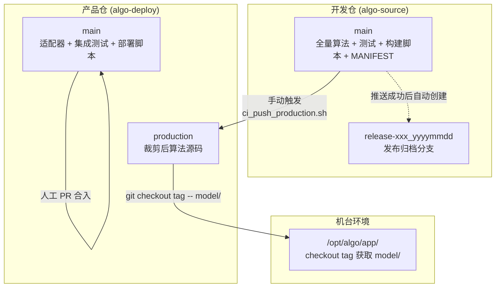
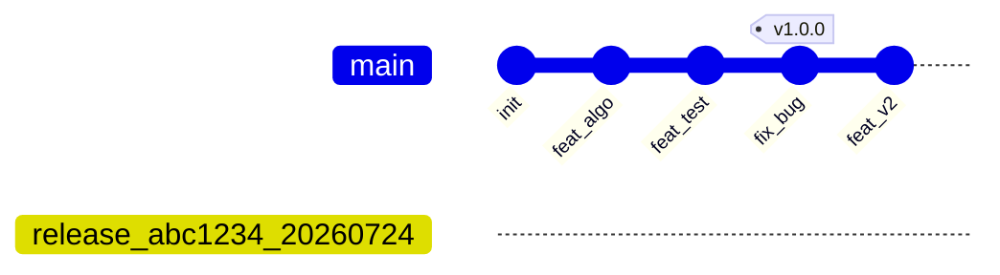
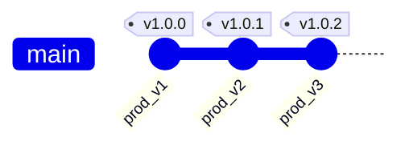
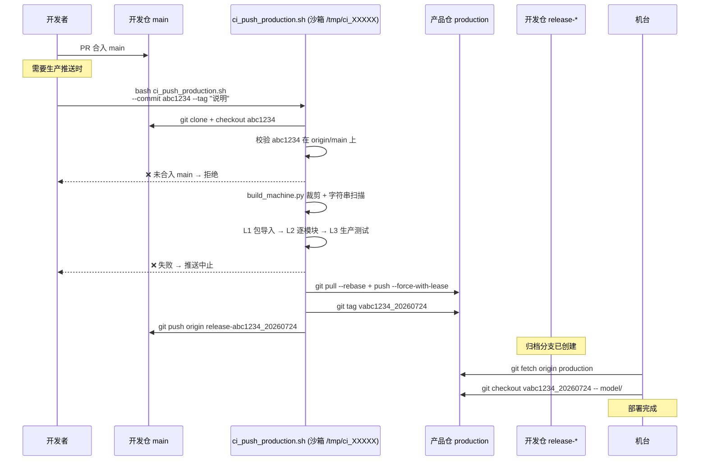
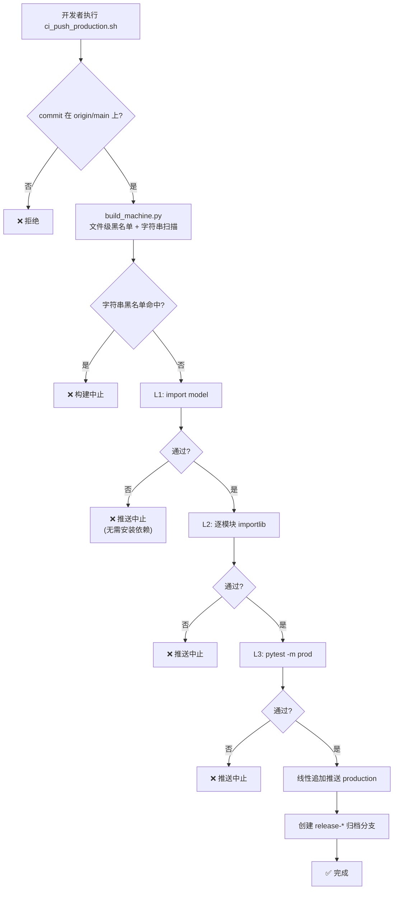
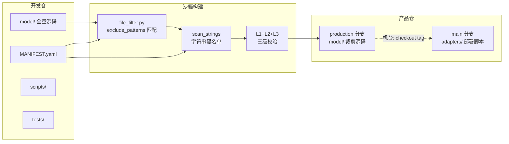

# Python 算法分仓管理方案 — 设计文档

> **版本**: v2.0
> **日期**: 2026-07-24
> **状态**: 已落地
> **适用范围**: Python 算法项目的开发、构建、交付全生命周期

---

## 一、方案概述

### 1.1 核心目标

一个开发仓持续演进（全量算法、实验、测试），机台环境只需核心代码子集。通过文件级黑名单筛选 + Git 分支制品 + 沙箱构建闭环，实现源码唯一性、物理隔离、合规切断。

### 1.2 核心原则

> **制品 = Git 分支上的裁剪源码。推送 = 线性追加。校验 = 三级闸门。**

- **开发仓**：唯一源码事实，允许全量
- **产品仓** `main` 分支：适配器 + 部署脚本，人工 PR 维护
- **产品仓** `production` 分支：裁剪后算法源码，CI 线性追加

### 1.3 仓库全景



---

## 二、仓库与分支

### 2.1 两仓库模型

实际只有两个 Git 仓库。制品不单独建仓，而是产品仓的一个独立分支。





| 仓库 | 分支 | 写权限 | 内容 | 说明 |
|------|------|:---:|------|------|
| **algo-source** | `main` | 人工 PR | 全量算法、测试、构建脚本、MANIFEST | 唯一源码事实 |
| | `release-{sha}_{ts}` | CI 自动 | 归档分支（指向源码 commit） | 只读，永不覆盖 |
| **algo-deploy** | `main` | 人工 PR | 适配器、集成测试、部署脚本、依赖锁 | 不含算法源码 |
| | `production` | CI 线性追加 | `model/` (裁剪源码) + `VERSION` | 孤儿分支，首次创建后持续追加 |

### 2.2 开发仓目录结构

```
source-repo/
├── model/                        # 所有算法实现
│   ├── matrix_ops/               # 矩阵运算 (basic/solve/decomposition)
│   ├── svd/                      # SVD (decompose/pseudo_inverse/approximation)
│   └── polyfit/                  # 多项式拟合 (fitting/interpolation/roots)
├── tests/                        # 全量测试 (prod/extended 分层)
├── scripts/                      # 构建脚本 (不进制品)
│   ├── build_machine.py          # 构建入口
│   ├── file_filter.py            # 文件过滤 + 字符串扫描 + 树状图
│   └── ci_push_production.sh     # 手动触发推送流水线
├── MANIFEST.yaml                 # 筛选规则 (CR 对象)
├── pytest.ini                    # 测试配置
└── docs/                         # 设计文档
```

---

## 三、筛选规则

### 3.1 MANIFEST.yaml

`MANIFEST.yaml` 是开发仓中**唯一控制制品范围的配置文件**，随代码版本走，纳入 Code Review。

```yaml
build:
  # 文件级黑名单 — 命中任一规则的文件不入制品
  exclude_patterns:
    - "**/test_*.py"
    - "**/conftest.py"
    - "scripts/**"
    - "pytest.ini"
    - "MANIFEST.yaml"
    - "**/__pycache__/**"
    - "**/*.pyc"

  # 字符串黑名单 — 裁剪后逐行扫描保留文件
  # 命中任一规则 → 构建中止
  string_blacklist:
    # - "GPL-3.0"
    # - "proprietary_key_xxxx"
```

### 3.2 筛选机制

**文件级黑名单**（`exclude_patterns`）：
- 扫描源目录下 `.py` / `.yaml` / `.json`，使用 `fnmatch` 通配符匹配（支持 `**` / `*` / `?`）
- 命中任一规则 → 排除；否则保留
- 复制后递归清理空目录

**字符串黑名单**（`string_blacklist`）：
- 裁剪完成后，逐文件逐行扫描所有保留的 `.py` 文件
- 大小写不敏感子串匹配
- 命中时打印完整清单（文件名 + 行号 + 匹配串）→ 构建中止

**树状图报告**：每次构建输出 `[KEPT]` + `[EXCLUDED]` 两份 ASCII 树，排序一致，可直接 `diff` 对比。

---

## 四、裁剪引擎

### 4.1 模块职责

| 模块 | 职责 | 依赖 |
|------|------|------|
| `file_filter.py` | `apply_exclude_filter` 文件匹配+复制 / `scan_strings` 字符串扫描 / `print_tree` 树状图 | Python 标准库 |
| `build_machine.py` | 构建入口：解析 MANIFEST → 过滤 → 扫描 → 树状图 | `pyyaml` + `file_filter` |

### 4.2 函数签名

```python
# file_filter.py
def apply_exclude_filter(
    src_root: Path, dst_root: Path, patterns: List[str]
) -> Tuple[List[Path], List[Path]]:
    """返回 (kept, excluded) 相对路径列表"""

def scan_strings(
    kept: List[Path], dst_root: Path, blacklist: List[str]
) -> List[Tuple[Path, int, str]]:
    """返回 [(文件, 行号, 命中字符串)] — 空列表 = 通过"""

def print_tree(file_list: List[Path], root_label: str, title: str) -> None:
    """打印 ASCII 目录树"""
```

---

## 五、同步推送流程

### 5.1 触发方式

手动执行，非自动。需要指定已合入 `main` 的 commit：

```bash
bash scripts/ci_push_production.sh \
    --commit abc1234 \
    --tag "修复 SVD 边界条件 + 更新依赖"
```

### 5.2 完整流水线



### 5.3 流水线阶段

| 阶段 | 操作 | 产物 | 失败处理 |
|:---:|------|------|:---:|
| 0 | `mktemp -d /tmp/ci_sandbox_XXXXX` + `trap cleanup EXIT` | 隔离沙箱 | — |
| 1 | `git clone` 开发仓 → `checkout <sha>` → 校验在 `origin/main` 上 | 指定版本 | ❌ 拒绝 |
| 2 | `venv` + `pip install pyyaml` | 隔离环境 | — |
| 3 | `build_machine.py`（文件过滤 + 字符串扫描 + 树状图） | 裁剪源码 | ❌ 中止 |
| 4 | L1 (import model) → L2 (逐模块 importlib) → L3 (pytest -m prod) | 三级校验 | ❌ 中止 |
| 5 | `git pull --rebase` + `git push --force-with-lease origin production` + tag | 线性追加推送 | ❌ 中止 |
| 6 | 开发仓 `git push origin release-{sha}_{timestamp}` | 版本归档 | — |

### 5.4 推送方式：线性追加

首次推送创建孤儿分支。后续每次在上一 commit 之后追加：

```
production 分支历史:
  584727c   production: 修复 SVD (source=abc1234)    ← 最新，parent=2a658ed
  2a658ed   production: 初始化 (source=bbb2e3b)      ← 首次 orphan root
```

```bash
# 追加机制
git checkout production
git reset --hard origin/production      # 对齐远程
# 清空工作树 → 复制新 model/ → commit    # 线性新增
git pull --rebase origin production      # 安全同步
git push --force-with-lease origin production  # 防并发覆盖
```

### 5.5 发布归档

每次推送成功后在开发仓创建归档分支：

```
release-abc1234_202607241450  → 指向 commit abc1234
release-def5678_202607251530  → 指向 commit def5678
```

分支名唯一，永不覆盖，永远可 checkout 复现。

---

## 六、三级校验闸门



| 层级 | 操作 | 检测 | 外部依赖 | 耗时 |
|:---:|------|------|:---:|:---:|
| **L1** | `import model` | 整个包的导入链是否完整 | 无（秒级快闸） | <1s |
| **L2** | 逐 `.py` `importlib.import_module` | 每个模块独立导入（不互相掩盖） | numpy, scipy | 1-2s |
| **L3** | `pytest -m prod` | 核心计算路径正确性 | pytest, numpy, scipy | ~30s |

L1 在 pip install 之前执行。失败时省去后续依赖安装时间。

---

## 七、合规与安全

### 7.1 三层防线

| 防线 | 机制 | 效果 |
|:---:|------|------|
| **1. 文件排除** | MANIFEST `exclude_patterns` 阻止整个文件进入制品 | GPL 文件物理不存在于产品仓 |
| **2. 字符串扫描** | `scan_strings` 逐行检查保留文件中是否含黑名单字符串 | 检测漏网之鱼（注释、字符串字面量中的敏感内容） |
| **3. 分支隔离** | 产品仓 `main` 和 `production` 独立分支 | 产品仓泄露不泄露算法源码（`main` 无 `model/`） |

### 7.2 依赖管理

CI 沙箱中安装全量依赖（numpy/scipy/pytest）执行 prod 测试。产品仓的 `requirements.lock` 仅作参考，全局依赖由产品仓上游统一管理，不进入产品仓分支。

---

## 八、数据流向



---

## 九、版本追踪链路

```
机台运行的 model/
  → 产品仓 production tag: v846638a_202607241450
    → production commit: 584727c
      → "source=846638a"
        → 开发仓 commit: 846638a
          → 归档分支: release-846638a_202607241450
```

从机台异常到定位源码 commit：读取 `VERSION` 文件 → `git checkout <sha>` → 复现调试。

---

## 十、选型原因

### 10.1 为什么两仓库而不是三仓库？

制品 = `production` 分支的 `model/` 目录，挂在产品仓内。单独建制品仓会多一个仓库的 clone/权限/同步开销。Git 分支本身提供版本历史、diff、tag，完全满足制品管理需求。

### 10.2 为什么用文件级黑名单而不是 AST 接口裁剪？

- **规则可审计**：排除列表一目了然，Code Review 直接可见
- **日志可审计**：两份 ASCII 树状图每次构建输出，可直接 diff 对比
- **零维护成本**：新增算法 = 文件放入 `model/`，无需额外标记
- **约束明确**：L1/L2 自动检测 ImportError，不需要手动检查依赖

### 10.3 为什么用三级校验？

- **L1**：秒级快闸，零额外依赖
- **L2**：精确定位断裂点，不互相掩盖错误
- **L3**：真实执行计算路径，暴露运行时错误
- **自动化**：不需要手动 `grep` 检查依赖关系

### 10.4 为什么用 Git 分支做制品？

- 版本追踪：commit SHA 天然链接到开发仓版本
- 回滚：`git checkout tag -- model/` 一步完成
- diff 可见：`git diff production` 展示变更
- 基础设施最简：不需要 PyPI 私有源或对象存储

### 10.5 为什么线性追加而不是 force push 覆盖？

- **可审计**：`git log origin/production` 展示完整发布历史
- **可回滚**：`git revert` 或 checkout 旧 commit
- **安全性**：`--force-with-lease` 防并发覆盖
- **与业务对齐**：每次推送是有计划的发布事件，需要历史记录

### 10.6 为什么手动触发？

- 发布是计划行为，不是每次合入 main 都需要推送机台
- `--tag` 填写发布说明，`--commit` 精确指定版本
- 原型阶段，后续由用户自行部署到 CI 平台

### 10.7 为什么沙箱闭环？

- **分支安全**：显式 `git clone --branch main`，不误用 feature 分支
- **清洁度**：`git status --porcelain` 检查
- **零污染**：临时文件在 `/tmp` 内，`trap EXIT` 清空
- **可复现**：任意机器执行脚本即可

---

## 十一、机台部署

机台端部署流程：

```bash
# 产品仓 main 分支上的 deploy.sh
git fetch origin production
git checkout v846638a_202607241450 -- model/
pip install -r requirements.lock
python -c "from model.svd.decompose import singular_values; ..."
```
