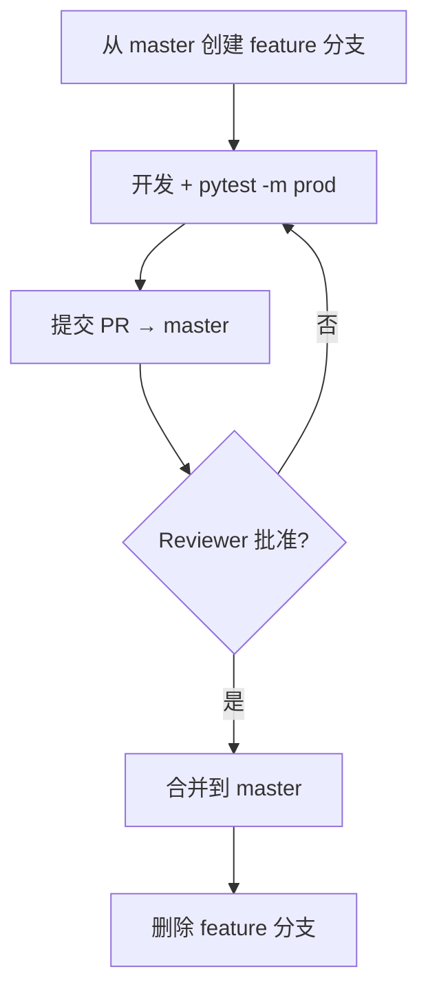
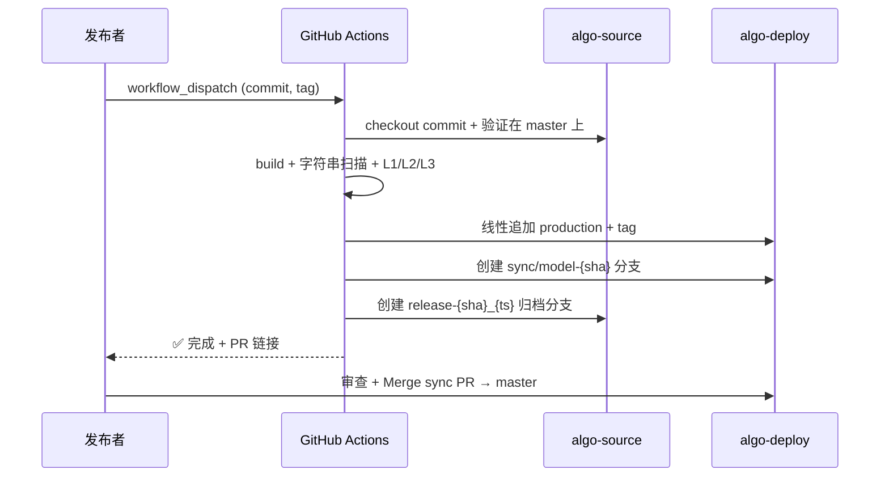

# 多用户开发与合入流程

> **适用仓库**: 开发仓 `algo-source` | **配套文档**: [仓库管理设计文档](repo-management-design.md)

---

## 一、角色

| 角色 | 职责 | 权限 |
|------|------|:---:|
| **开发者** | 编写算法、测试、文档 | PR → master（需 Reviewer） |
| **Reviewer** | Code Review，MANIFEST 变更需 2 人确认 | 批准/拒绝 PR |
| **发布者** | 触发 GA 流水线，合入 sync/model-* PR | 操作 workflow + Merge |

（角色分离：写代码的人不推生产，推生产的人不改代码。发布是计划行为，不是自动触发。）

---

## 二、日常开发



### 分支命名

```
feature/<模块>-<简述>     # feature/svd-add-qr
fix/<模块>-<问题>         # fix/polyfit-nan-edge
manifest/<简述>           # manifest/exclude-experimental
```

（统一前缀便于 `git branch --list` 和 CI 日志归类。）

### MANIFEST 变更规则

MANIFEST 控制制品范围。必须独立 PR + 至少 **2 位 Reviewer**。PR 描述必须说明排除原因。

（影响面大，两人交叉验证降低误排除风险。）

---

## 三、生产推送

发布者在 GitHub Actions 手动触发：

```
Actions → 生产推送 → Run workflow
  输入: commit = "abc1234"  (必须在 master 上)
        tag    = "V1.3: xxx"
```



**发布者 Checklist：**
- [ ] 目标 commit 已合入 master
- [ ] MANIFEST 无未审查变更
- [ ] tag 格式：`V{版本}: {变更摘要}`

（手动触发 = 发布是计划行为。Checklist 是最后的人为防线。）

---

## 四、并发冲突处理

### 代码冲突

```
场景: A 和 B 同时改 basic.py, A 先合入, B 的 PR 冲突。

B:
  ① git checkout master && git pull
  ② git checkout feature/b && git rebase master
     （rebase 保持历史线性，方便 bisect）
  ③ 解决冲突 → pytest → git push --force-with-lease
     （--force-with-lease 防覆盖他人推送）
  ④ PR 自动更新
```

### MANIFEST 冲突

后合入的 PR 必须 rebase 到最新 master。Reviewer 确认两个变更的组合效果。（MANIFEST 是列表，自动合并可能产生语义矛盾。）

### 生产推送并发

发布者 A 推送时，B 也想推送。`--force-with-lease` 确保 B 的推送被拒绝。B 必须 `pull --rebase` 后重新推送。（防覆盖。）

---

## 五、master 同步合入

每次生产推送后，GA 在 algo-deploy 创建 `sync/model-{sha}` 分支。**发布者人工审查后 Merge 到 master。**

```
sync PR 的内容: 仅 model/ 目录变更
master 其他目录:  adapters/, config/, tests/ 不受影响
→ 合并时永无冲突（文件集互斥）
```

---

## 六、分支生命周期

| 分支 | 类型 | 生命周期 | 说明 |
|------|------|:---:|------|
| `master` | 永久 | ∞ | 唯一事实来源 |
| `feature/*` | 临时 | ≤ 2 周 | 超期合并成本指数增长 |
| `manifest/*` | 临时 | ≤ 3 天 | 影响面大，快速合入减少阻塞 |
| `release-*` | 归档 | ∞ | 永不删除，唯一追溯凭证 |
| `sync/model-*` | 临时 | ≤ 1 天 | 合入后删除 |

---

## 七、禁止事项

| 禁止 | 原因 |
|------|------|
| ❌ 直接 push master | 所有变更必须 PR + Review |
| ❌ 生产推送未合入 master 的 commit | 推送 = 上线，未审查代码不能上线 |
| ❌ force push master 分支 | master 是所有分支的基准 |
| ❌ 手动修改 algo-deploy 的 master 或 production | 产品仓由 GA 管理 |
| ❌ 一个 PR 含功能 + MANIFEST 变更 | 分开审查 |
| ❌ 跳过 L1/L2/L3 校验 | 三级校验是唯一自动化防线 |
