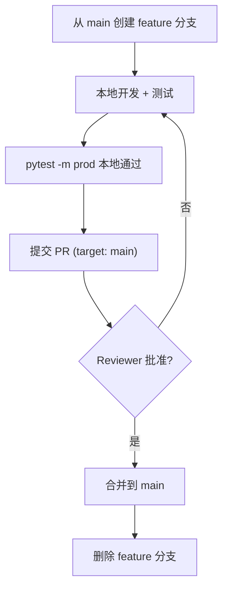
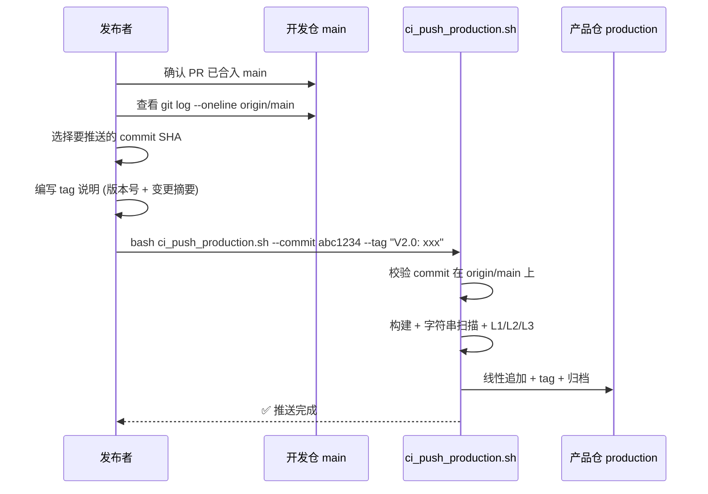

# 多用户并发开发规范流程

> **适用仓库**: 开发仓 `algo-source`（产品仓 `algo-deploy` 由 CI 自动维护，开发者不直接操作）

---

## 一、角色定义

| 角色 | 职责 | 权限 |
|------|------|:---:|
| **开发者** | 编写算法、测试、文档 | PR → main（需 Reviewer 批准） |
| **Reviewer** | Code Review，确认 MANIFEST 变更合理 | 批准/拒绝 PR |
| **发布者** | 手动执行生产推送 | 执行 `ci_push_production.sh` |

（角色分离：写代码的人不直接推生产，Reviewer 不直接写代码，发布者是唯一的推送触发点。这样即使多人并发开发，生产推送的决策权始终集中在一个人手中。）

---

## 二、日常开发流程

### 2.1 普通功能开发



**步骤：**

```bash
# 1. 从最新 main 拉分支（为什么？避免基于过时代码开发，减少合并冲突）
git checkout main && git pull origin main
git checkout -b feature/my-algorithm

# 2. 开发 + 本地验证（为什么？在 PR 之前跑 prod 测试，减少 CI 往返）
# 编写代码...
pytest -m prod

# 3. 提交 + 推送（为什么？Conventional Commits 让 git log 可读，CHANGELOG 可自动生成）
git add -A
git commit -m "feat: 新增 xxx 算法"
git push origin feature/my-algorithm

# 4. 在 GitHub 创建 PR: feature/my-algorithm → main
#    指定至少一位 Reviewer（为什么？多人并发时，Reviewer 确认代码不会破坏其他人的工作）
```

### 2.2 MANIFEST.yaml 变更

MANIFEST.yaml 控制制品范围，变更影响生产推送。**必须走独立 PR。**

```bash
# 1. 单独分支（为什么？MANIFEST 变更不能夹在功能 PR 中混过去）
git checkout -b manifest/update-exclusions

# 2. 修改 MANIFEST.yaml
#    a. 新增/修改 exclude_patterns
#    b. 新增/修改 string_blacklist

# 3. PR 描述中必须说明（为什么？Reviewer 需要理解排除原因，而非盲目批准）
#    - 排除哪些文件/目录
#    - 排除原因（合规/调试/实验代码）
#    - L1/L2 校验是否已验证不会被依赖

# 4. PR 需要至少 2 位 Reviewer（为什么？MANIFEST 变更影响面大，
#    排除错了会导致 ImportError，两人交叉验证降低风险）
```

### 2.3 多人并发：分支命名规范

```
feature/<模块>-<简述>      # feature/svd-add-qr
fix/<模块>-<问题>          # fix/polyfit-nan-edge
manifest/<简述>            # manifest/exclude-experimental
hotfix/<问题>              # hotfix/critical-bug
```

（为什么？统一前缀让 `git branch --list` 和 CI 日志一眼识别分支类型。多人并发时不会出现"feature1"、"feature2"这种无意义命名。）

---

## 三、并发冲突处理

### 3.1 代码冲突

```
场景: 开发者 A 和 B 同时修改 basic.py，A 的 PR 先合入，B 的 PR 出现冲突。

B 的处理流程:
  ① git checkout main && git pull
  ② git checkout feature/b-task && git rebase main
     （为什么 rebase 而非 merge？保持 main 历史线性，方便 git bisect）
  ③ 解决冲突 → 本地 pytest → git push --force-with-lease
     （为什么 --force-with-lease？rebase 后历史改变，需 force，但不覆盖他人推送）
  ④ PR 自动更新，通知 Reviewer 重新审查
```

### 3.2 MANIFEST 冲突

```
场景: 两个 MANIFEST PR 都修改了 exclude_patterns。

处理: 先合入的 PR 优先。后合入的 PR 必须 rebase 到最新 main，
      Reviewer 需确认两个变更的组合效果是否符合预期。
     （为什么不是自动合并？exclude_patterns 是列表，自动合并只会追加，
      但语义上可能矛盾。必须人工确认。）
```

### 3.3 生产推送冲突

```
场景: 发布者 A 正在推送，发布者 B 也想推送。

处理: ci_push_production.sh 使用 --force-with-lease 推送。
      如果 A 先完成，B 推送时 lease 校验失败 → 拒绝推送。
      B 必须 pull --rebase 后重新推送。
     （为什么？防止 B 的推送覆盖 A 刚推送的内容。
      --force-with-lease 比裸 force push 多一层并发保护。）
```

---

## 四、生产推送流程

由发布者在开发仓执行：



**发布者 Checklist（推送前必须逐项确认）：**

- [ ] 目标 commit 已合入 main（`git merge-base --is-ancestor`）
- [ ] 所有关联 PR 的 prod 测试已通过
- [ ] MANIFEST 无未审查的变更
- [ ] tag 说明格式：`V{版本号}: {变更摘要}`

（为什么要有 Checklist？手动推送没有 CI 自动闸门保护，人的记忆不可靠。Checklist 是最后的防线。）

---

## 五、紧急热修复

```
场景: 生产环境发现严重 bug，需要跳过常规流程快速推送。

流程:
  ① git checkout -b hotfix/critical-bug origin/main
     （为什么从 main 切？热修复也需要基于最新代码，不能基于本地脏工作树）
  ② 编写修复 + pytest -m prod
  ③ PR → main（可加速审查: 添加 HOTFIX 标签）
  ④ 合入后立即执行 ci_push_production.sh
     （为什么仍然需要 PR？即使是热修复，也必须有人 Review。
      跳过 Review 的 hotfix = 在恐慌中引入新 bug。）
  ⑤ 推送完成后通知团队
```

---

## 六、版本管理

### 6.1 版本号规则

```
V{major}.{minor} — 语义版本

major 变更: 不兼容的 API 变更、大规模重构
minor 变更: 新增功能、bug 修复、文档更新

示例:
  V1.0  → 初始版本
  V1.1  → 新增 matrix_power + polyfit_ridge
  V1.2  → 新增 svd_reconstruct
  V2.0  → 重构 model/ 目录结构 (不兼容)
```

### 6.2 发布日志

每次推送后，在 `docs/CHANGELOG.md` 中记录：

```markdown
## V1.2 (2026-07-27)

- feat: 新增 svd_reconstruct (SVD 分量重构矩阵)
- source: 7ec5125
- production tag: v7ec5125_202607270940
```

（为什么手写 CHANGELOG 而非自动生成？commit message 面向开发者，CHANGELOG 面向使用者。两者的信息粒度不同。）

---

## 七、分支生命周期

```
main ─────────────────────────────────────────────→ (永久)
  │
  ├── feature/xxx ────→ PR 合入 → 删除 (临时, ≤2周)
  │   （为什么限制 2 周？长生命周期的 feature 分支合并冲突成本指数增长）
  │
  ├── manifest/xxx ────→ PR 合入 → 删除 (临时, ≤3天)
  │   （为什么更短？MANIFEST 影响面大，快速合入减少阻塞）
  │
  ├── hotfix/xxx ────→ PR 合入 → 删除 (临时, ≤1天)
  │   （为什么最短？热修复必须尽快上线）
  │
  └── release-xxx_yyyymmddHHMM → 永不删除 (归档, CI 自动创建)
      （为什么不删除？归档分支是生产推送的唯一追溯凭证，
       删除后无法复现历史生产版本。）
```

---

## 八、禁止事项

| 禁止 | 原因 |
|------|------|
| ❌ 直接在 main 上 commit | 所有变更必须走 PR + Review（多人并发时直接 push main 会绕过测试和审查） |
| ❌ 生产推送使用未经 Review 合入的 commit | 推送即上线，未 Review 的代码上线 = 没人对质量负责 |
| ❌ force push main 分支 | main 是所有 feature 分支的基准，rewrite 历史会导致所有 PR 冲突 |
| ❌ 手动修改产品仓 `main` 或 `production` 分支 | 产品仓由 CI 管理，手动修改 = 绕过所有安全闸门 |
| ❌ 跳过 L1/L2/L3 校验 | 三级校验是唯一自动化防线，跳过 = 盲飞 |
| ❌ 一个 PR 包含功能变更 + MANIFEST 变更 | 两者必须分开 Review（混在一起无法判断变更意图） |
