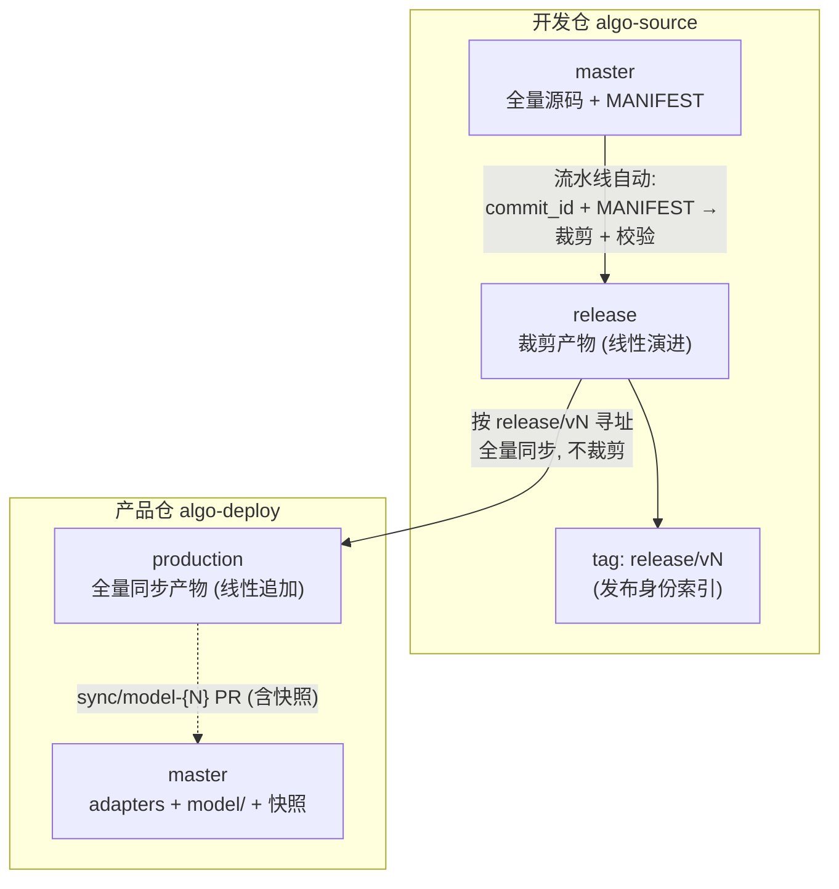

# release 分支方案 — 设计总结

> **状态**: 方案讨论中 (未落地) | **日期**: 2026-08-04 | **版本**: v3.0
> **变更**: v2.0 → v3.0 按 code-review 修复: 明确"永远线性追加无回补"、校验基准 content_hash、sync PR 闭环、tag 命名统一

---

## 一、核心设想

开发仓内单一 **release 分支线性演进**：`起始点 → 版本A → 版本B`。流水线每次触发执行"同步-裁剪-commit-push"，在 release 分支上**永远线性追加** commit（无 force、无回补、无改写历史）。

release 分支是"唯一裁剪点 + 可测试的待发布代码 + 发布编年史"三位一体的载体。



## 二、分支定义

| 项目 | 定义 |
|------|------|
| **分支名** | `release`（固定，单一分支） |
| **生成方式** | 流水线自动：从 master 指定 commit + 当前 MANIFEST 裁剪 |
| **提交方式** | **永远线性追加**（空树重建全量快照 → commit → push，无 force 路径） |
| **内容** | `model/` 裁剪产物 + `MANIFEST.snapshot.yaml` + `BUILD_REPORT.txt` + `VERSION` |
| **写权限** | 仅 CI Bot（分支保护） |
| **生命周期** | 永不删除、永不改写（历史即归档） |

### release 分支历史形态

```
release 分支:  git log --oneline release
  v3  release: V1.2 (source=9cd93a5, manifest=abc, content=x1)   ← head
  v2  release: V1.1 (source=8ce687d, manifest=def, content=x2)
  v1  release: V1.0 (source=7ec5125, manifest=ghi, content=x3)
  起始点 (孤儿 root)
```

**核心不变量**: 分支结构永远只由"追加"决定。`version_id` 是**commit 内的元数据**（VERSION 文件 + commit message 字段），不参与分支寻址、不影响分支结构。

## 三、流水线流程

```
Job 1: 裁剪 + 校验 (唯一裁剪点)
  ① 输入: commit_id (必填) + semver (必填) + tag 描述 (必填) + version_id (可选)
  ② 文件级黑名单裁剪 (exclude_patterns)
  ③ 字符串扫描 (string_blacklist)
  ④ L1 包导入 → L2 逐模块 → L3 pytest prod
  ⑤ 生成 release 分支新 commit (永远追加):
       首次:  git checkout --orphan release
       后续:  git checkout release && git pull origin release
       git rm -rf --cached . && find . -delete    ← 空树重建 (机制2)
       cp 裁剪产物 (model/ + MANIFEST.snapshot + BUILD_REPORT + VERSION)
       git commit -m "release: {semver} (source={sha}, manifest={hash}, content={hash})"
       git push origin release                     ← 普通 push, 永不 force
  ⑥ 打发布身份 tag: release/v{N}  (N = 上次 tag 序号 + 1, 由流水线自动)

Job 2: 发布 (全量同步, 不裁剪)
  ⑦ 从 release 分支 checkout release/v{N} → 同步 model/ + VERSION + MANIFEST.snapshot.yaml
     → production (线性追加) + 对外 tag v{semver}
  ⑧ 创建 sync/model-{N} 分支 (内容 = model/ + VERSION + MANIFEST.snapshot.yaml)
     → 人工 PR 合入产品仓 master
```

## 四、四个强制机制（council 裁决）

### 机制 1: 每次发布同步打 tag（发布身份索引）

```
release/v1  → release 分支第 1 个发布 commit
release/v2  → release 分支第 2 个发布 commit
release/vN  → 由流水线自动递增 (上次 tag 序号 + 1), 不接受人工覆盖
```

**为什么**: 单分支 head 是"易变状态"而非"发布身份"。tag 是发布身份的唯一索引，辨识版本与回退都 O(1)。

### 机制 2: 每次发布 = 从空树重建的全量快照提交

```
git checkout release && git pull origin release   # 对齐最新
git rm -rf --cached . && find . -delete           # 清空工作树
cp 裁剪产物 → git add → git commit                  # 全量快照
git push origin release                            # 普通 push (快进)
```

**为什么**: 严禁增量 merge 语义。杜绝两类致命残留：
- MANIFEST 新排除的文件不会留在树上（增量同步会残留旧文件）
- 分支上的手动改动会被下一次发布覆盖（孤儿性自动免疫）

**永远不 force**：push 必然快进。若 push 被拒（说明有异常提交），流水线**失败终止**并告警，绝不 force 改写。

### 机制 3: 血缘透传 + content_hash 校验基准

commit message + VERSION 文件强制携带：

```
VERSION:
  semver:        v1.2.0     ← 对外版本 (产品仓 tag, 发布者输入)
  version_id:    7          ← 发布序号元数据 (可选输入, 仅记录)
  release_tag:   v3         ← 内部发布序号 (开发仓 tag, 流水线自动)
  source_commit: 9cd93a5    ← master SHA (血缘根)
  manifest_hash: abc123     ← MANIFEST 快照哈希
  content_hash:  x1y2z3     ← 裁剪产物 model/ 树哈希 (校验基准)
```

**校验基准 = content_hash（model/ 树的 SHA-256），不是整树**：
- BUILD_REPORT.txt 含时间戳/描述等非确定性内容，不参与哈希
- 流水线校验：重新裁剪后计算 model/ 树哈希，与 VERSION.content_hash 比对，不一致 → 失败终止

**为什么**: 同 commit 重新裁剪（MANIFEST 演进）会得到不同的树，旧版本不可复现——VERSION 元组是唯一自包含的"当时实际发布内容"记录。

### 机制 4: 发布路径按 release/vN 寻址，永不消费 head

```
Job 2 同步源 = git checkout release/v3 -- model/ VERSION MANIFEST.snapshot.yaml   (tag)
            绝不 = git checkout release -- model/   (head)
```

**为什么**: head 是易变状态。按 tag 寻址保证"发布的内容 = 测试的内容"。

---

## 五、与现有方案的关键差异

| 维度 | 现有方案 | release 分支方案 |
|------|------|------|
| 裁剪发生位置 | 发布流水线内部 | **master → release（开发仓内，提前）** |
| 裁剪次数 | 每次发布一次 | **唯一裁剪点**，release → production 不再裁剪 |
| 测试环境 | 无（只能看 GA 日志） | **`git checkout release/v1` 直接跑** |
| 归档机制 | `release-{sha}_{ts}` 只读分支 | **release 分支历史本身即归档** |
| 待发布内容可见性 | 发布瞬间才可见 | **发布前随时可见、可 diff、可测试** |
| 发布身份 | tag 在 production | **release/v{N} + v{semver} 双重索引** |

## 六、设计理由

1. **提前可见**: release 分支内容 = 将要发布的内容，开发者随时拿到全量待发布代码测试
2. **裁剪点唯一**: master → release 是唯一裁剪点，无"双裁剪点规则漂移"
3. **归档即历史**: 线性演进让归档自然成为历史，`git log release` 即发布编年史；永不 force 保证历史可信
4. **可复现性**: 每版本快照 commit 树 + content_hash 是自包含的"当时实际发布内容"记录
5. **机制强制而非纪律**: 空树重建 + content_hash 校验 + tag 索引 + tag 寻址，全部由流水线执行；force 路径不存在

## 七、验收流程

```bash
# 测试待发布代码
git checkout release/v3            # 指定版本 (推荐)
git checkout release               # 或 head = 最新候选
pip install -r requirements.txt
python -m pytest tests/ -m "prod"  # 或直接跑机台模拟

# 测试通过后触发发布
# Actions → 生产推送 → 输入 commit + semver + tag
# Job 1 在 release 分支线性追加快照 commit + 打 release/v{N}
# Job 2 按 release/v{N} 同步到 production + 打 v{semver} tag
# Job 2 创建 sync/model-{N} PR 合入产品仓 master

# 回退 = 新发布 (永远往后迭代)
# 从 release 历史选旧 commit 的内容, 以新版本号重新走 Job 1+2:
#   Actions → 生产推送 → commit=旧commit → semver=v1.2.1 → tag="回退到 V1.0 内容"
# release 分支追加新 commit, production 追加新 commit + 新 tag
```

## 八、决策记录

### 8.1 分支保护

**✅ 已确认: release 分支启用 GitHub 分支保护，仅允许 CI Bot 推送。**

```
algo-source → Settings → Branches → release 分支保护规则:
  - 仅允许 CI Bot (PAT) 推送
  - 禁止人工 push (Require pull request reviewing 不适用, 直接 deny push)
  - 禁止 force push (与"永不改写"承诺一致)
```

### 8.2 版本递增与元数据

**✅ 已确认: 永远线性追加，无回补场景。构建参数只影响 commit 内字段，不决定分支结构。**

```
Actions → 生产推送 → 输入:
  commit:      (必填) master 上的 commit
  semver:      (必填) 对外版本号, 如 v1.2.0 (写入 VERSION + 产品仓 tag)
  tag:         (必填) 发布描述 (commit message)
  version_id:  (可选) 发布序号元数据, 仅记录到 VERSION, 不影响任何寻址

流水线自动: release/v{N} = 上次 tag 序号 + 1 (不接受人工覆盖)
```

### 8.3 产品仓版本与 release 的对应关系

**✅ 已确认: 职责分离 + VERSION 文件记录映射。**

```
开发仓 release 分支:  release/v1, release/v2, release/v3   ← 内部发布序号 (自动)
产品仓 production:    v1.0.0, v1.1.0, v1.2.0              ← 对外语义版本 (人工输入)

对应关系记录在随发布同步的 VERSION 文件中 (唯一映射真相):
  VERSION:
    semver:        v1.1.0          ← 对外版本 (产品仓 tag)
    release_tag:   v3              ← 内部发布序号 (开发仓 tag)
    source_commit: 9cd93a5         ← master SHA (血缘根)
    manifest_hash: abc123          ← MANIFEST 快照哈希
    content_hash:  x1y2z3          ← 裁剪产物树哈希 (校验基准)
    release_date:  20260804
    tag:           V1.1: 新增 xxx  ← 发布描述
```

**理由**: tag 名是脆弱的编码渠道（改名即断链）；VERSION 随产物透传、机器可读，是唯一映射真相。双向回退可定位：机台事故说 "v1.0.0" → VERSION 查到 release/v1 → 开发仓溯源。

### 8.4 MANIFEST 快照记录

**✅ 已确认: 产品仓同步 MANIFEST.snapshot.yaml，树状图留开发仓。**

```
production 分支内容 (每次发布同步):
  model/                      ← 裁剪产物
  VERSION                     ← 血缘 + 映射 (见 8.3)
  MANIFEST.snapshot.yaml      ← 规则快照 (随产物, 机器可审计)

sync/model-{N} PR 内容 (产品仓 master 同步, 与 production 完全一致):
  model/ + VERSION + MANIFEST.snapshot.yaml    ← 三分文件一起, 保证分区一致性

BUILD_REPORT.txt (树状图) 留在开发仓 release 分支:
  → 通过 VERSION.release_tag 反查, 不冗余同步
```

**理由**: 审计链贯通——产品仓 production 和 master 都携带规则快照，可自证"用什么规则裁剪、哪些文件被排除"；同步内容三文件打包，保证分区模型（model/ 与 adapters/ 互斥）不被破坏。
