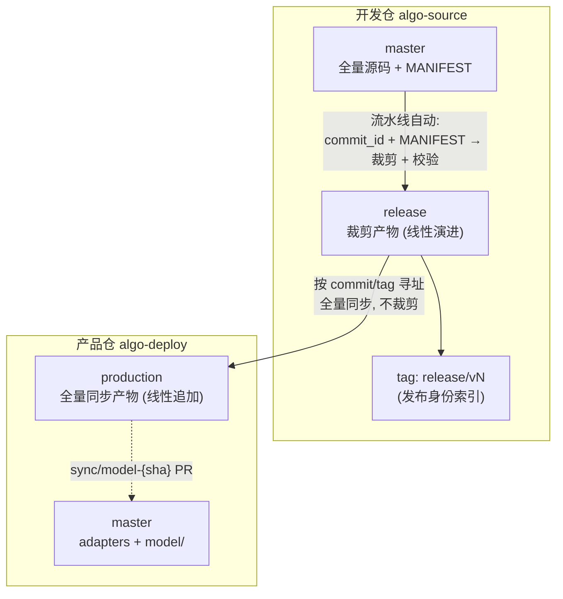

# release 分支方案 — 设计总结

> **状态**: 方案讨论中 (未落地) | **日期**: 2026-08-04 | **版本**: v2.0
> **变更**: v1.0 的 release/{sha} 每版本一分支 → v2.0 单一 release 分支线性演进（经 council 裁决 + 4 个强制机制）

---

## 一、核心设想

开发仓内单一 **release 分支线性演进**：`起始点 → 版本A → 版本B`。流水线每次触发执行"同步-裁剪-commit-push"，在 release 分支上线性追加 commit（不 force 覆盖）。

release 分支是"唯一裁剪点 + 可测试的待发布代码 + 发布编年史"三位一体的载体。



## 二、分支定义

| 项目 | 定义 |
|------|------|
| **分支名** | `release`（固定，单一分支） |
| **生成方式** | 流水线自动：从 master 指定 commit + 当前 MANIFEST 裁剪 |
| **提交方式** | **每次发布 = 从空树重建的全量快照提交**（线性追加，不 force） |
| **内容** | `model/` 裁剪产物 + `MANIFEST.snapshot.yaml` + `BUILD_REPORT.txt` + `VERSION` |
| **写权限** | 仅流水线 |
| **生命周期** | 永不删除（历史即归档） |

### release 分支历史形态

```
release 分支:  git log --oneline release
  v3  release: V3.0 (source=9cd93a5, manifest=abc, hash=x1)   ← head
  v2  release: V2.0 (source=8ce687d, manifest=def, hash=x2)
  v1  release: V1.0 (source=7ec5125, manifest=ghi, hash=x3)
  起始点 (孤儿 root)
```

## 三、流水线流程

```
Job 1: 裁剪 + 校验 (唯一裁剪点)
  ① 输入: commit_id + MANIFEST.yaml
  ② 文件级黑名单裁剪 (exclude_patterns)
  ③ 字符串扫描 (string_blacklist)
  ④ L1 包导入 → L2 逐模块 → L3 pytest prod
  ⑤ 生成 release 分支新 commit:
       git checkout --orphan 起始 (首次) / git checkout release (后续)
       git rm -rf --cached . && find . -delete   ← 空树重建
       cp 裁剪产物 (model/ + MANIFEST.snapshot + BUILD_REPORT + VERSION)
       git commit -m "release: {TAG} (source={sha}, manifest={hash}, content={hash})"
       git push origin release
  ⑥ 打发布身份 tag: release/v{N} (或 v{sha}_{ts})

Job 2: 发布 (全量同步, 不裁剪)
  ⑦ 从 release 分支 checkout 指定 commit/tag → 同步 model/ → production (线性追加) + tag
  ⑧ 创建 sync/model-{sha} 分支 → 人工 PR 合入产品仓 master
```

## 四、四个强制机制（council 裁决）

### 机制 1: 每次发布同步打 tag（发布身份索引）

```
release/v1.0  → release 分支 v1 的 commit
release/v1.1  → release 分支 v2 的 commit
```

**为什么**: 单分支 head 是"易变状态"而非"发布身份"。没有 tag，辨识版本（同 commit + MANIFEST 变更重发时历史无法区分）和回退（遍历历史逐个读 VERSION = O(n) 考古）都退化为翻历史。tag 是发布身份的唯一索引。

### 机制 2: 每次发布 = 从空树重建的全量快照提交

```
git rm -rf --cached . && find . -delete   # 清空工作树
cp 裁剪产物 → git add → git commit          # 全量快照
```

**为什么**: 严禁增量 merge 语义。杜绝两类致命残留：
- MANIFEST 新排除的文件不会留在树上（增量同步会残留旧文件）
- 分支上的手动改动会被下一次发布覆盖（孤儿性自动免疫，不需要人遵守约定）

**校验**: CI 严格校验 release 树 == 裁剪(master sha, 当前 MANIFEST) 的精确结果。

### 机制 3: 血缘透传

commit message + VERSION 文件强制携带（详见 §8.3 完整格式）：

```
VERSION:
  semver:        v1.1.0     ← 对外版本 (产品仓 tag)
  release_tag:   v3         ← 内部发布序号 (开发仓 tag)
  source_commit: 9cd93a5    ← master SHA (血缘根)
  manifest_hash: abc123     ← MANIFEST 快照哈希
  content_hash:  x1y2z3     ← 裁剪产物内容哈希
```

**为什么**: 真正的血缘记录在裁剪日志中，不在 git 拓扑里。同 commit 重新裁剪（MANIFEST 演进）会得到不同的树，旧版本不可复现——VERSION 中的三元组是唯一自包含的"当时实际发布内容"记录。

### 机制 4: 发布路径按 commit/tag 寻址，永不消费 head

```
Job 2 同步源 = git checkout release/v1.0 -- model/   (tag)
            = git checkout <release commit sha> -- model/   (commit)
            绝不 = git checkout release -- model/   (head)
```

**为什么**: head 是易变状态。若 production 从 head 构建，可靠性全押在"head 恰好对"——测试期间若有人触发新发布，head 前移，发布内容与测试内容分叉。按 commit/tag 寻址保证"发布的内容 = 测试的内容"。

---

## 五、与现有方案的关键差异

| 维度 | 现有方案 | release 分支方案 |
|------|------|------|
| 裁剪发生位置 | 发布流水线内部 | **master → release（开发仓内，提前）** |
| 裁剪次数 | 每次发布一次 | **唯一裁剪点**，release → production 不再裁剪 |
| 测试环境 | 无（只能看 GA 日志） | **`git checkout release` 直接跑** |
| 归档机制 | `release-{sha}_{ts}` 只读分支 | **release 分支历史本身即归档** |
| 待发布内容可见性 | 发布瞬间才可见 | **发布前随时可见、可 diff、可测试** |
| 发布身份 | tag 在 production | **release/v{N} tag + production tag 双重索引** |

## 六、设计理由

1. **提前可见**: release 分支内容 = 将要发布的内容，开发者随时拿到全量待发布代码测试
2. **裁剪点唯一**: master → release 是唯一裁剪点，无"双裁剪点规则漂移"
3. **归档即历史**: 线性演进让归档自然成为历史，`git log release` 即发布编年史
4. **可复现性**: 每版本快照 commit 树是自包含的"当时实际发布内容"，同 commit 重裁也不影响旧版本追溯
5. **机制强制而非纪律**: 空树重建（机制 2）+ 血缘透传（机制 3）+ tag 索引（机制 1）+ commit/tag 寻址（机制 4），全部由流水线执行，不依赖人遵守约定

## 七、验收流程

```bash
# 测试待发布代码
git checkout release/v1.0          # 或 checkout release (head = 最新候选)
pip install -r requirements.txt
python -m pytest tests/ -m "prod"  # 或直接跑机台模拟

# 测试通过后触发发布
# Actions → 生产推送 → 输入 commit + tag
# Job 1 在 release 分支追加快照 commit + 打 release/v{N} tag
# Job 2 按 tag 同步到 production

# 回退
# 从 release 历史找旧 tag → checkout release/v0.9 -- model/ → 同步 production
```

## 八、决策记录

### 8.1 分支保护

**✅ 已确认: release 分支启用 GitHub 分支保护，仅允许 CI Bot 推送。**

```
algo-source → Settings → Branches → release 分支保护规则:
  - 仅允许 CI Bot (PAT) 推送
  - 禁止人工 push (Require pull request reviewing 不适用, 直接 deny push)
```

### 8.2 release/v{N} 递增方式

**✅ 已确认: N 由构建参数控制（workflow_dispatch 输入）。**

```
Actions → 生产推送 → 输入:
  commit:    (必填)
  tag:       (必填, 发布描述)
  release_n: (可选, 默认自动 = release 分支 commit 数 + 1)
```

流水线读取 release 分支 commit 数作为默认值，构建参数可覆盖（用于回补/重发场景）。

### 8.3 产品仓版本与 release 的对应关系

**✅ 已确认: 职责分离 + VERSION 文件记录映射。**

```
开发仓 release 分支:  release/v1, release/v2, release/v3   ← 内部发布序号
产品仓 production:    v1.0.0, v1.1.0, v1.2.0              ← 对外语义版本

对应关系记录在随发布同步的 VERSION 文件中 (唯一映射真相):
  VERSION:
    semver:        v1.1.0          ← 对外版本 (产品仓 tag)
    release_tag:   v3              ← 内部发布序号 (开发仓 tag)
    source_commit: 9cd93a5         ← master SHA (血缘根)
    manifest_hash: abc123          ← MANIFEST 快照哈希
    content_hash:  x1y2z3          ← 裁剪产物内容哈希
    release_date:  20260804
    tag:           V1.1: 新增 xxx  ← 发布描述
```

**理由**: tag 名是脆弱的编码渠道（改名即断链）；VERSION 随产物透传、机器可读，是唯一映射真相。双向回退可定位：机台事故说 "v1.0.0" → VERSION 查到 release/v1 → 开发仓溯源。

### 8.4 MANIFEST 快照记录

**✅ 已确认: 产品仓同步 MANIFEST.snapshot.yaml，树状图留开发仓。**

```
production 分支内容 (每次发布同步):
  model/                      ← 裁剪产物
  VERSION                     ← 血缘 + 映射 (见 8.3)
  MANIFEST.snapshot.yaml      ← 规则快照 (随产物, 机器可审计)

BUILD_REPORT.txt (树状图) 留在开发仓 release 分支:
  → 通过 VERSION.release_tag 反查, 不冗余同步
```

**理由**: 审计链贯通——任何人拿到产品仓 production 即可自证"用什么规则裁剪、哪些文件被排除"；快照仅几 KB 随产物同步无负担；树状图较大且仅在审查时需要，反查即可。
