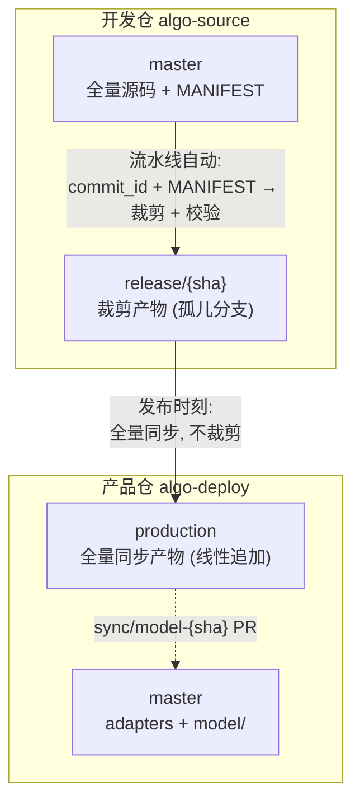

# release 分支方案 — 设计总结

> **状态**: 方案讨论中 (未落地) | **日期**: 2026-08-04

---

## 一、核心设想

在开发仓内部增加一个 **release 分支**，作为"唯一裁剪点 + 可测试的待发布代码 + 归档"三位一体的载体。



## 二、分支定义

| 项目 | 定义 |
|------|------|
| **分支名** | `release/{commit_short}` (如 `release/8ce687d`) |
| **生成方式** | 流水线自动，从 master 的指定 commit + 当前 MANIFEST.yaml 裁剪得到 |
| **分支类型** | 孤儿分支（每次发布强制重建，与 master 无共同历史） |
| **内容** | 裁剪产物 `model/` + MANIFEST 快照 + 裁剪日志 + VERSION |
| **写权限** | 仅流水线 |
| **生命周期** | 永不删除（兼具归档语义） |

## 三、流水线流程

```
Job 1: 裁剪 + 校验 (唯一裁剪点)
  ① 输入: commit_id + MANIFEST.yaml
  ② 文件级黑名单裁剪 (exclude_patterns)
  ③ 字符串扫描 (string_blacklist)
  ④ L1 包导入 → L2 逐模块 → L3 pytest prod
  ⑤ 生成 release/{sha} 孤儿分支:
       model/                    ← 裁剪产物
       MANIFEST.snapshot.yaml    ← 规则快照 (可自证)
       BUILD_REPORT.txt          ← [KEPT]/[EXCLUDED] 树状图
       VERSION                   ← source commit + 时间 + tag

Job 2: 发布 (全量同步, 不裁剪)
  ⑥ 从 release/{sha} 同步 model/ → production (线性追加) + tag
  ⑦ 创建 sync/model-{sha} 分支 → 人工 PR 合入产品仓 master
```

## 四、与现有方案的关键差异

| 维度 | 现有方案 | release 分支方案 |
|------|------|------|
| 裁剪发生位置 | 发布流水线内部（开发仓 → 产品仓同步时） | **master → release/{sha}（开发仓内，提前）** |
| 裁剪次数 | 每次发布一次 | **唯一一次**，release → production 不再裁剪 |
| 测试环境 | 无（只能看 GA 日志） | **`git checkout release/{sha}` 直接跑** |
| 归档机制 | 发布后创建 `release-{sha}_{ts}` 只读分支 | **release/{sha} 本身即归档**，不再单独创建 |
| 待发布内容可见性 | 发布瞬间才可见 | **发布前随时可见、可 diff、可测试** |

## 五、设计理由

1. **提前可见**：release 分支内容 = 将要发布的内容，开发者随时拿到全量待发布代码进行测试，不必等到发布时刻
2. **裁剪点唯一**：master → release 是唯一裁剪点，release → production 纯搬运。不存在"双裁剪点规则漂移"问题
3. **归档合一**：release/{sha} 孤儿分支天然不可变，替代原 `release-{sha}_{ts}` 归档分支，语义统一
4. **发布路径变短**：production 从 release 全量同步，发布时刻不再重跑裁剪，失败面缩小
5. **可审计**：release 分支自带 MANIFEST 快照 + 裁剪日志，任何时刻可自证"内容对应哪个规则版本"

## 六、护栏要求

- [ ] release 分支名绑定 commit_id → 强制"每次发布重新生成"，禁止复用旧 release 分支（防过期裁剪合规泄漏）
- [ ] release → production 同步**release 分支内容**（裁剪后的 model/），绝不从 master 同步（保隔离）
- [ ] release 分支携带 MANIFEST 快照 + 裁剪日志（可自证、可审计）
- [ ] 发布路径唯一：production 只接受来自 release 分支的同步

## 七、验收流程

```bash
# 测试待发布代码
git checkout release/8ce687d
pip install -r requirements.txt
python -m pytest tests/ -m "prod"     # 或直接跑机台模拟

# 测试通过后触发发布
# Actions → 生产推送 → 输入 commit + tag
# Job 1 重新生成 release/{sha} (幂等) → Job 2 全量同步 production
```
