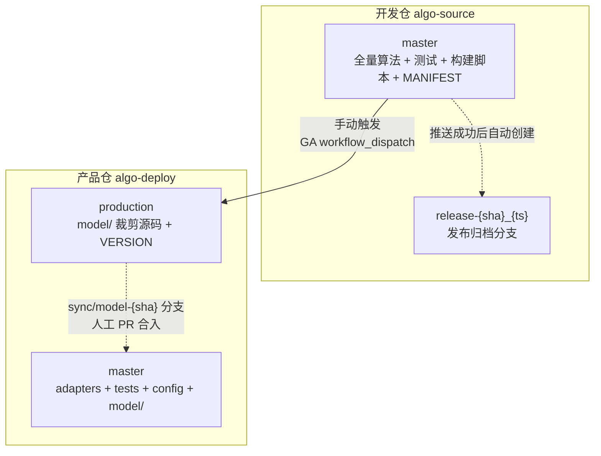

# 仓库管理设计文档

> **版本**: v3.0 | **日期**: 2026-07-27 | **状态**: 已落地

---

## 一、架构概览

两个 Git 仓库，四个分支角色。



## 二、仓库与分支

| 仓库 | 分支 | 内容 | 写权限 | 维护方式 |
|------|------|------|:---:|------|
| **algo-source** | `master` | 全量算法、测试、构建脚本、MANIFEST | 人工 PR | 日常开发 |
| | `release-{sha}_{ts}` | 归档分支（指向源码 commit） | CI 自动 | 只读，永不删除 |
| **algo-deploy** | `master` | adapters + tests + config + deploy.sh + **model/** | 人工 PR | model/ 来自 sync 分支 PR |
| | `production` | model/ 裁剪源码 + VERSION | CI 线性追加 | 孤儿分支，独立演进 |

### 分区模型（核心设计）

```
algo-deploy master 的文件集:
  {model/} ← 来自 production (通过 sync/model-* PR 人工合入)
  {adapters/, tests/, config/, deploy.sh, ...} ← 来自人工 PR

冲突 = {model/} ∩ {adapters/, tests/, config/}
     = ∅  → 永无冲突
```

**model/ 只由 CI 创建的 sync 分支更新。adapters/ 等只由人工 PR 更新。两方修改互斥的文件集，合入时永远不会出现 merge conflict。**

## 三、筛选规则

`MANIFEST.yaml` 位于开发仓根目录，是唯一控制制品范围的文件，随代码版本走：

```yaml
build:
  exclude_patterns:       # 文件级黑名单 (fnmatch 通配符)
    - "**/test_*.py"
    - "scripts/**"
    - "pytest.ini"
    - ...

  string_blacklist:       # 字符串扫描 (裁剪后逐行检查)
    - "GPL-3.0"
```

## 四、构建流水线

GitHub Actions `workflow_dispatch` 手动触发：

| 阶段 | 操作 | 失败处理 |
|:---:|------|:---:|
| 检出 | `checkout@v4` 指定 commit | — |
| 构建 | `build_machine.py` 文件过滤 + 字符串扫描 + 树状图 | ❌ |
| L1 | `import model` 包级导入 | ❌ |
| L2+L3 | 逐模块导入 + `pytest -m prod` | ❌ |
| 推送 | 线性追加 production + tag | ❌ |
| 同步 | 创建 `sync/model-{sha}` 分支 | — |
| 归档 | 创建 `release-{sha}_{ts}` 分支 | — |

## 五、production 分支

- 首次推送创建孤儿分支，后续线性追加
- 每次推送：`git pull --rebase` + `git push --force-with-lease`
- 历史始终为单链，与开发仓 master 的非线性历史无关

## 六、master 同步

```
CI 推送 production 后:
  ① git checkout master
  ② git checkout production -- model/    # 只替换 model/
  ③ git checkout -b sync/model-{sha}
  ④ git commit + push
  ⑤ 人工创建 PR → Review → Merge 到 master
```

---

## 七、选型原因

### 为什么两仓库？

制品（production 分支）挂在产品仓。Git 分支提供版本历史、diff、tag，不需额外基础设施。

### 为什么文件级黑名单？

规则可审计（Code Review 可见），日志可审计（ASCII 树状图），零维护成本（新增算法=放入 model/）。

### 为什么 production 线性追加？

可审计（完整发布历史）、可回滚（checkout 旧 commit）、`--force-with-lease` 防并发覆盖。

### 为什么 model/ 分区同步？

CI 只改 model/，人工只改 adapters/，互斥文件集 → 永不冲突。
